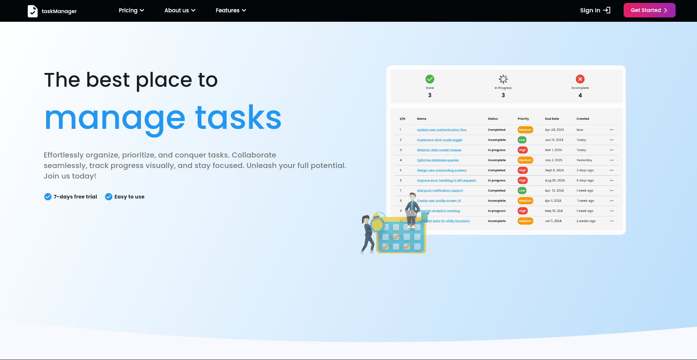
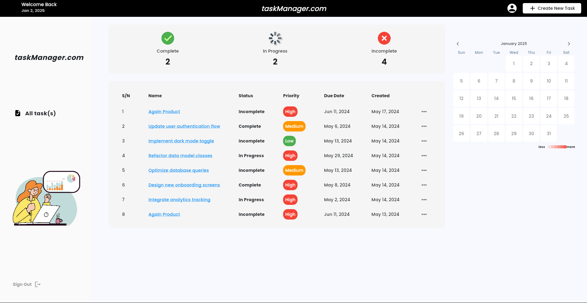
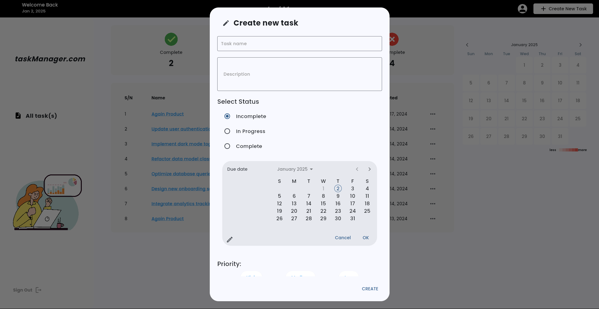

A streamlined platform for organizing and tracking tasks efficiently. Built using Django for the backend and Flutter for the frontend, the system allows users to create, update, and manage tasks with features like due dates, priority levels, and status tracking. It includes user authentication, a clean and responsive interface, and real-time updates to ensure effective collaboration and productivity.

